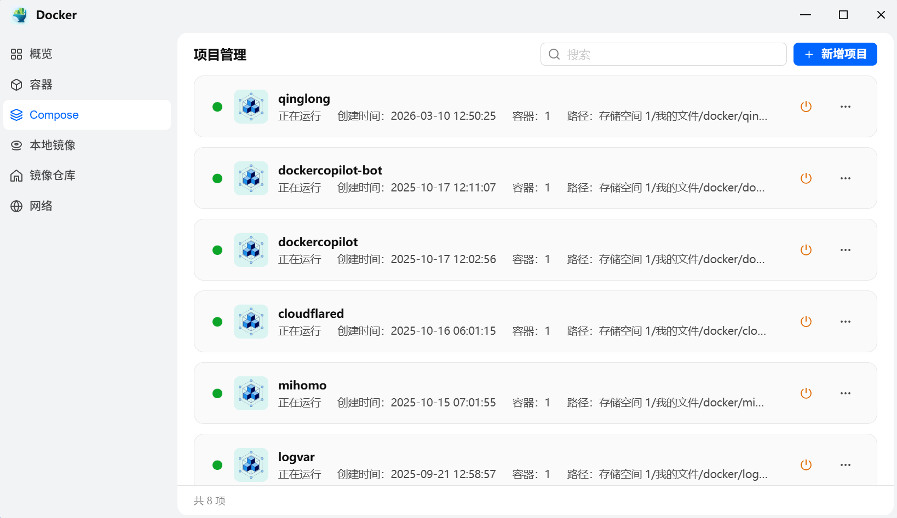
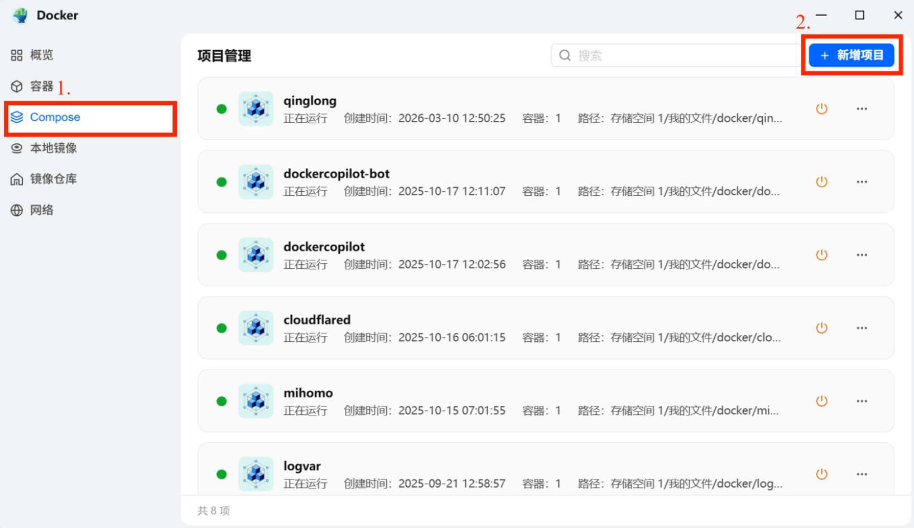
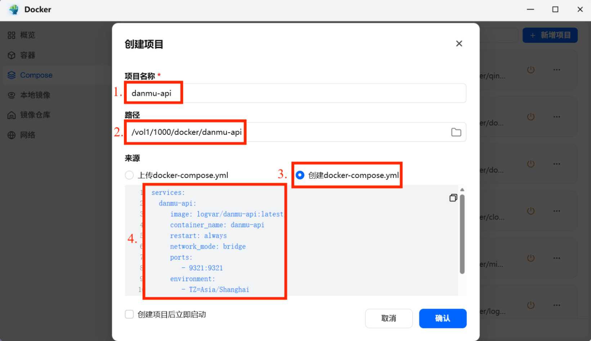
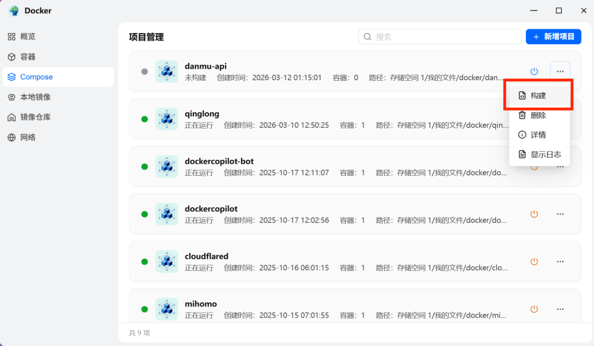
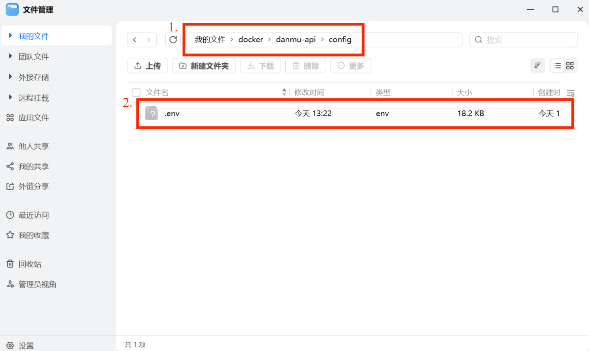
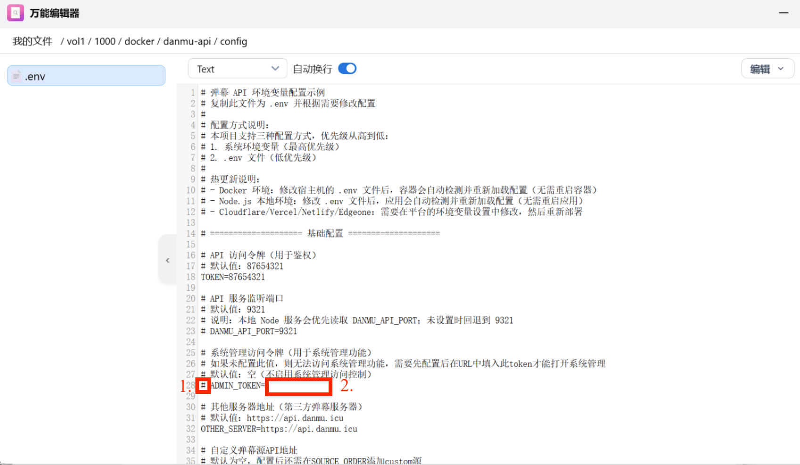
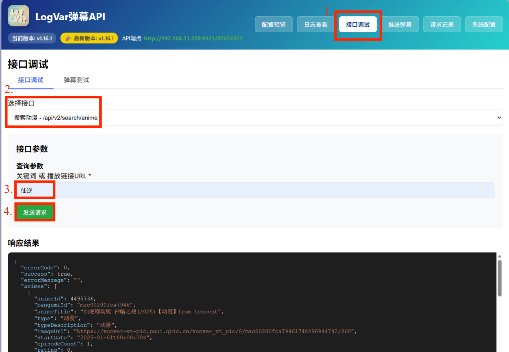
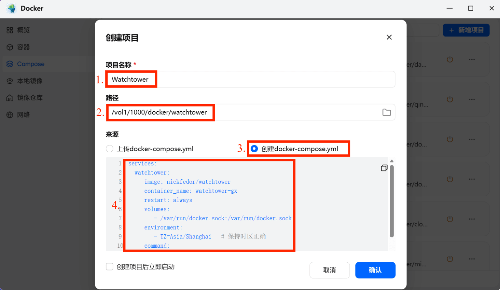
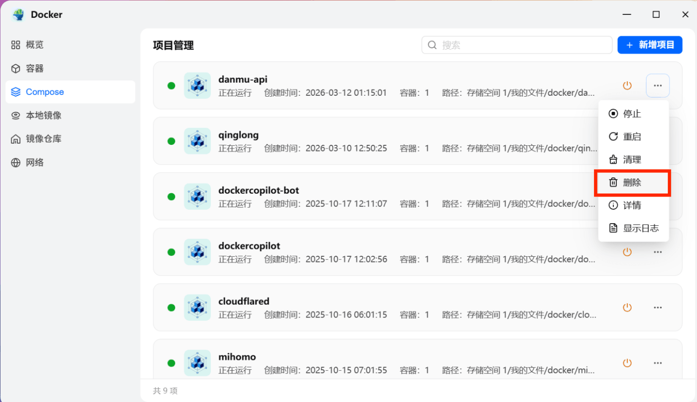

# Docker版弹幕danmu_api图文部署教程（面板安装版）🎉

## 一、准备环境

### 1. 服务器要求🖥️

- Linux服务器/NAS/VPS
- 可访问公网网络
- 已开放部署端口（9321）

### 2. 安装 Docker🐳

NAS一般已自带，无需再次安装，可直接看教程第三部分。

Linux服务器安装：

```bash
curl -fsSL https://get.docker.com | bash
```

验证安装：

```bash
docker -v
```
输出示例：Docker version xx.x.x, build xxxxxxx，表示安装成功。

## 二、安装管理面板🛠️

### 1. Linux服务器/VPS

推荐使用 1panel 面板，[1panel官方安装教程](https://1panel.cn/docs/v2/installation/online_installation)

### 2. NAS用户

可直接使用自带的管理面板



## 三、创建danmu_api容器📦（以飞牛OS为例）

### 1. 进入创建compose页面



### 2. 填写相关配置

•	项目名称可自定义
  
•	路径可自定义
  
•	docker-compose.yml请直接复制粘贴下面提供的内容：



docker-compose配置文件：
```yaml
services:
  danmu-api:
    image: logvar/danmu-api:latest
    container_name: danmu-api
    restart: always
    network_mode: bridge
    ports:
      - 9321:9321
    environment:
      - TZ=Asia/Shanghai
    volumes:
      - ./config:/app/config  # 挂载config目录后，会自动在config目录下创建.env配置文件
      - ./cache:/app/.cache   # 挂载.chche目录后，会将缓存实时保存在本地文件，无需再配置redis
```

### 3. 构建镜像

直接点击**构建**按钮即可。



## 四、配置管理员权限🔑

### 1. 打开.env配置文件

路径为前面挂载的 config 目录下。



### 2. 配置ADMIN_TOKEN

•	删除行首的 #

•	在 = 后填写自定义值



## 五、访问danmu_api🌐

### 1. 浏览器访问

•	普通权限：
```
http://服务器IP:9321/TOKEN
```

•	管理员权限：
```
http://服务器IP:9321/ADMIN_TOKEN
```

### 2. API测试

切换到接口调试菜单 → 选择“搜索动漫接口” → 输入关键词 → 点击发送请求 → 查看响应结果。

下方的响应结果内能正确显示搜索的内容，说明项目部署完毕，可正常使用。



## 六、自动更新容器🎯

引入 Watchtower 容器，实现镜像自动更新，安装步骤与上面同理：


docker-compose配置文件：
```yaml
services:
  watchtower:
    image: nickfedor/watchtower
    container_name: watchtower-gx
    restart: always
    volumes:
      - /var/run/docker.sock:/var/run/docker.sock
    environment:
      - TZ=Asia/Shanghai  # 保持时区正确
    command:
      - --cleanup         # 更新后清理旧镜像
      - --interval        # 间隔参数
      - "12600"           # 30分钟（1800秒），适合测试
      - danmu-api         # 监控的目标容器名
```

## 七、卸载容器🗑️

如需卸载，直接在面板点击删除，即可完整卸载容器。


## 八、常见问题（FAQ）❓

### 1. 弹幕匹配错

弹幕匹配错可以考虑以下两种方案：

① 使用剧名映射表TITLE_MAPPING_TABLE，用于自动匹配时替换标题进行搜索，格式：原始标题->映射标题;原始标题->映射标题;... ，例如："唐朝诡事录->唐朝诡事录之西行;国色芳华->锦绣芳华"。

② 打开记住手动选择结果环境变量REMEMBER_LAST_SELECT。

### 2.搜索结果缺集

搜索结果缺集可以考虑检查以下两个方面：

① 默认配置的源是360,vod,renren,hanjutv四个，其中360和VOD等采集站不一定采集了全集，请添加官方源（tencent,youku,iqiyi,imgo,bilibili,migu,sohu,leshi,xigua,maiduidui,renren,hanjutv,bahamut,dandan,animeko）或douban源后重新尝试。

② 请确认是否开启了ENABLE_EPISODE_FILTER手动搜索集标题过滤开关，以及EPISODE_TITLE_FILTER环境变量中有没有过滤关键字匹配到了集标题。

### 3. 巴哈姆特弹幕获取失败

① 巴哈姆特需要能够访问国外的网络环境，国内服务器请使用PROXY_URL变量配置网络代理。

② 巴哈姆特源的标题可能与国内的不同，请配置TMDB_API_KEY变量，可以帮助巴哈姆特源进行日语原名搜索，提高成功率。


# Docker版弹幕danmu_api部署教程（命令行安装版）🎉

## 一、准备环境

### 1. 服务器要求🖥️

- Linux服务器/NAS/VPS
- 可访问公网网络
- 已开放部署端口（9321）

### 2. 安装 Docker🐳

NAS一般已自带，无需再次安装，可直接看教程第三部分。

Linux服务器安装：

```bash
curl -fsSL https://get.docker.com | bash
```

验证安装：

```bash
docker -v
```
输出示例：Docker version xx.x.x, build xxxxxxx，表示安装成功。

## 二、创建danmu_api容器📦

### 1.拉取镜像：
```
docker pull logvar/danmu-api:latest
```

### 2.运行容器：
执行此命令后会挂载config/.env，可以直接打开.env文件修改配置，修改后无需重启容器，自动热重载。
```
docker run -d -p 9321:9321 --name danmu-api -v $(pwd)/config:/app/config --env-file .env logvar/danmu-api:latest
```

## 三、创建danmu_api容器📦（docker-compose版）

### 1.创建项目目录
```
mkdir -p ~/danmu_api
cd ~/danmu_api
```

### 2.创建 docker-compose.yml
```
nano docker-compose.yml
```
写入以下内容：
```yaml
services:
  danmu-api:
    image: logvar/danmu-api:latest
    container_name: danmu-api
    restart: always
    network_mode: bridge
    ports:
      - 9321:9321
    environment:
      - TZ=Asia/Shanghai
    volumes:
      - ./config:/app/config  # 挂载config目录后，会自动在config目录下创建.env配置文件
      - ./cache:/app/.cache   # 挂载.chche目录后，会将缓存实时保存在本地文件，无需再配置redis
```

### 3.启动容器
```
docker compose up -d
```
